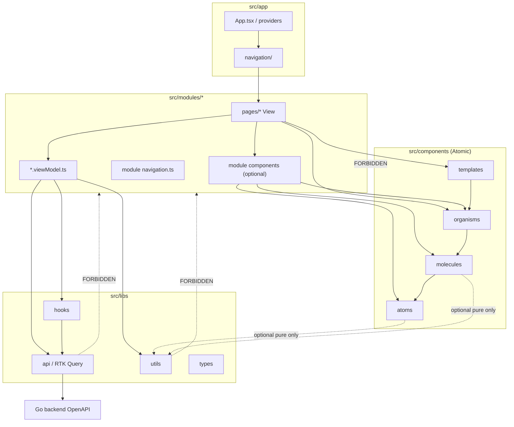
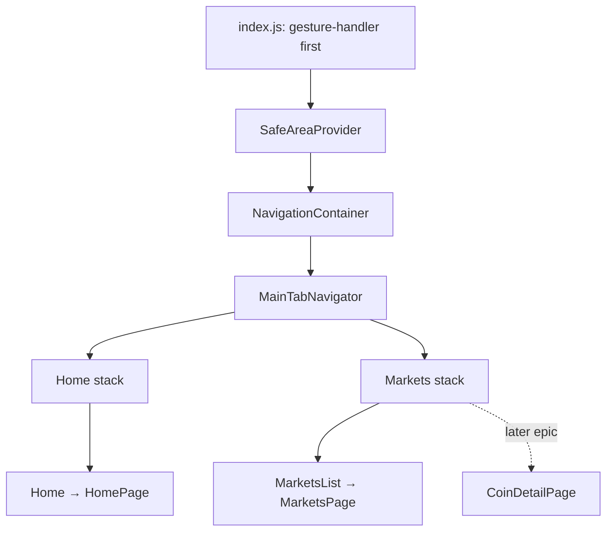
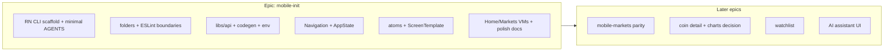
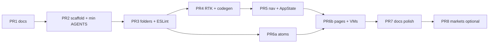

# Design: Mobile (React Native) system design

| Field | Value |
|-------|-------|
| **Document** | System design — Swyngora mobile architecture |
| **Author** | TBD (Engineering) |
| **Date** | 2026-07-26 |
| **Status** | Ready for implementation |
| **Epic label** | `mobile` · `type::epic` · `epic::mobile-init` |
| **Priority** | P0 for mobile track — start with project initialization |
| **Branch pattern** | `feature/mobile-init-*` from `develop` |
| **Target package** | `mobile/` (**does not exist yet**) |
| **Init plan** | `docs/design/mobile-project-initialization.md` |
| **Local PM** | `project-management/epics/mobile-project-initialization.md` |
| **Related** | root `AGENTS.md` §6.6 / §6.8 / §6.9; `docs/design/frontend-system-design.md`; `frontend/src/styles/tokens/`; `backend/api/openapi/openapi.yaml` |
| **Revision** | 2026-07-26 — design review resolved; color tokens locked to frontend |

---

## Overview

Swyngora already has a production **web** client under `frontend/` (Vite + React + Ant Design + Lightweight Charts + RTK Query + OpenAPI codegen) and a Go backend with a stable OpenAPI contract. The monorepo reserves `mobile/` for a **React Native** client that must share the same product conventions: Atomic Design, RTK Query, OpenAPI-generated types, and background cache hygiene (AppState).

This document designs the **initialization** of a **bare React Native CLI** app (no Expo managed workflow, no Expo modules as foundation). Architecture deliberately **diverges from web’s pages-under-components layout**: shared UI primitives live in `src/components/` (atoms → molecules → organisms → templates only); **feature modules under `src/modules/<name>/` own their pages/screens**. Every page follows an **MVVM-style contract**: a thin View (`*.tsx`) plus an explicit **ViewModel** (`*.viewModel.ts`) that owns RTK Query wiring, navigation side effects, and presentation orchestration.

**Scope of this epic is scaffold + conventions + shell**, not full markets parity. Init ships a runnable Android/iOS app with navigation, Redux/RTK Query, codegen, theme tokens, a health/smoke screen, and stub modules (`app`, `markets`). Full multi-exchange markets list/detail are a **follow-on epic**, reusing the same module/page/VM patterns.

---

## Background & Motivation

### Why mobile now

| Driver | Detail |
|--------|--------|
| Product surface | Root `AGENTS.md` lists React Native as a first-class client alongside web |
| Parity path | Web already proves markets APIs, RTK Query shape, brand tokens, and codegen |
| Agent-ready structure | Without a nested `mobile/AGENTS.md` **from the first code PR** and locked folder contracts, agents will invent Expo or copy web’s `components/pages/` anti-pattern for mobile |
| Architecture correction | Web currently colocates pages under `frontend/src/components/pages/` (see `MarketsPage`); mobile must **not** copy that — pages belong to modules |

### Current state

| Layer | Today |
|-------|-------|
| Backend | Go API on `:8080`; OpenAPI at `backend/api/openapi/openapi.yaml` |
| Web product | `frontend/` — Atomic components, `libs/api`, `features/markets`, pages under `components/pages/` |
| Simple harness | `simple-frontend/` — static HTML; not a design-system home |
| Mobile | **`mobile/` does not exist** |
| Shared packages | No `packages/api-types` yet; web codegens into `frontend/src/libs/api/generated/` |

### Pain points this design addresses

| Pain | Approach |
|------|----------|
| Expo vs bare RN ambiguity | Hard requirement: **React Native CLI only**; document Expo rejection trade-offs |
| Pages mixed into Atomic tree | **Modules own pages**; `components/` never contains pages |
| Fat screens (web `MarketsPage.tsx` mixes URL state, queries, UI) | **View + ViewModel** split on every page |
| Drift from OpenAPI | Same codegen discipline as web: `openapi-typescript` → `libs/api/generated/` |
| Stale market data on background | `AppState`-aware hooks + **primary** pause of `pollingInterval` (§6.6); not browser `refetchOnFocus` alone |
| WSL/Windows RN tooling | Explicit risk section + recommended host for Android emulator / device |
| Web-only kits (antd, lightweight-charts) | RN-appropriate UI kit recommendation + chart decision deferred |
| Agent import drift | **ESLint `no-restricted-imports`** on `components/` and `libs/` |

### Reference: what web does today (adapt, don’t clone)

**Reusable patterns**

- `src/libs/api/{baseApi,store,hooks,endpoints,generated}`
- `src/libs/hooks` (visibility → becomes AppState)
- `src/libs/utils` pure formatters (`formatPrice`, `spotQuery`, etc.)
- Brand tokens: navy `#111844`, indigo `#4B5694`, steel `#7288AE`, cream `#EAE0CF`
- Prefixed component files: `Name.tsx`, `Name.types.ts`, `Name.styles.ts`, …
- OpenAPI codegen command pattern: `openapi-typescript ../backend/api/openapi/openapi.yaml -o …`
- Health endpoint: `GET /health` → `useGetHealthQuery` in `healthApi.ts`

**Do not copy on mobile**

- `components/pages/*` as the page home
- `features/` naming (mobile uses **`modules/`** per hard requirement)
- Ant Design / styled-components as defaults
- Pages without ViewModels (web pages are fat; mobile formalizes MVVM)
- Empty `VITE_API_BASE_URL` / same-origin proxy (mobile has **no** Vite proxy — absolute URL required)

---

## Goals & Non-Goals

### Goals (mobile-init epic)

1. Create **`mobile/`** as a **React Native CLI + TypeScript** app (community CLI / `@react-native-community/cli` style), **without Expo**.
2. Encode **Atomic Design** under `src/components/` for **atoms / molecules / organisms / templates only** — **no pages inside `components/`**.
3. Introduce **`src/modules/<moduleName>/`** architecture where **each module owns its pages** (and optional module-local UI).
4. Enforce a **page + ViewModel folder contract** (MVVM): View is presentational; ViewModel consumes RTK Query / services / navigation — with **normative TypeScript shapes** for init stubs.
5. Wire **RTK Query + Redux store** under `src/libs/api`, mirror web tag types and endpoint injection style.
6. Wire **OpenAPI codegen** from `backend/api/openapi/openapi.yaml` into `src/libs/api/generated/` (never hand-edit).
7. Set up **React Navigation** (stack + tabs foundation) with typed param lists, entry-file peers, and module screen exports.
8. Define **styling / theme** approach for RN (StyleSheet + design tokens; custom atoms first).
9. Implement **AppState** cache hygiene: primary control via `pollingInterval` from `useAppStateActive()` (and later `useIsFocused()`).
10. Ship **minimal `mobile/AGENTS.md` + README in the first scaffold PR**; expand and sync root AGENTS as structure grows (per monorepo §8.2).
11. Enforce dependency direction with **ESLint restricted imports** (and document how to check).
12. Smoke quality gates: typecheck, lint, unit tests, **Android health call against local backend**.
13. Plan first stub modules: **`app`** (Home + health) and **`markets`** (placeholder with normative stub VM, not full table parity).

### Non-Goals (explicit)

| Out of scope for init | Why |
|-----------------------|-----|
| Full multi-exchange markets table / coin detail parity with web | Separate epic (mobile-markets) after init |
| Auth, watchlist UI, AI chat UI, paper trading | Later product epics |
| Expo managed / Expo Router / Expo modules foundation | Hard user rejection |
| Shared monorepo package for OpenAPI types (`packages/api-types`) | Optional later; init **duplicates codegen** in mobile like web |
| Publishing to App Store / Play Store pipelines | Ops later |
| Replacing `simple-frontend` or changing web layout | Web can migrate pages-out-of-components later; not blocked by mobile |
| Class-based ViewModels or MobX | Rejected (see Alternatives) |
| Full charting library integration | Deferred; process model later can follow `docs/design/frontend-chart-libraries.md` → future `mobile-chart-libraries` decision |
| **i18n framework** (`i18next`, etc.) | Matches web (English-only product copy; no i18n library in `frontend/package.json`) |
| MSW / full network-layer integration tests | Init uses mocked RTK hooks; MSW deferred |
| Native modules beyond what RN template + Navigation peers need | Keep deps minimal |
| `react-native-config` / multi-flavor native env wiring | Deferred; init uses **compile-time defaults in `env.ts`** (K14) |

---

## Proposed Design

### 1. High-level architecture

```text
┌──────────────────────────────────────────────────────────────────────────┐
│  src/app/                                                                │
│  entry providers · root navigation · theme · SafeAreaProvider            │
└───────────────────────────────┬──────────────────────────────────────────┘
                                │ mounts screens from
┌───────────────────────────────▼──────────────────────────────────────────┐
│  src/modules/<name>/                                                     │
│  pages/ (View + ViewModel) · optional components/ · navigation.ts        │
└───────────────────────────────┬──────────────────────────────────────────┘
                                │ imports UI from
┌───────────────────────────────▼──────────────────────────────────────────┐
│  src/components/   Atomic ONLY                                           │
│  atoms → molecules → organisms → templates                               │
│  NO pages/  ·  no module imports  ·  no RTK in atoms/molecules           │
└───────────────────────────────┬──────────────────────────────────────────┘
                                │ data via
┌───────────────────────────────▼──────────────────────────────────────────┐
│  src/libs/                                                               │
│  api (RTK Query + OpenAPI generated) · hooks · utils · types             │
└───────────────────────────────┬──────────────────────────────────────────┘
                                │ HTTP (absolute base URL)
┌───────────────────────────────▼──────────────────────────────────────────┐
│  Swyngora backend :8080  (OpenAPI contract)                              │
└──────────────────────────────────────────────────────────────────────────┘
```

### 2. Dependency direction (mandatory)



**Hard rules**

1. **`src/components/**` must not import `src/modules/**` or pages.**
2. **`src/libs/**` must not import modules, pages, app, or Atomic components.**
3. **Atoms / molecules must not call RTK Query or navigation.**
4. **Pages import ViewModels; ViewModels do not import page JSX or React Native UI components.** ViewModels may return plain data + callbacks only — **never React elements**.
5. **Organisms may receive data via props from pages/VMs; they do not own server state.**
6. Lower Atomic levels never import higher levels.
7. **Modules must not import other modules’ pages** (cross-module navigation via typed navigation only).

#### 2.1 Enforcement tooling (required in init)

Prose rules alone will drift. Init **must** enforce boundaries with ESLint:

```js
// eslint.config.js (sketch) — apply via overrides by path
// src/components/** : no-restricted-imports patterns for '@/modules', '@/app'
// src/libs/**       : no '@/modules', '@/app', '@/components'
```

| Layer path | Forbidden import prefixes |
|------------|---------------------------|
| `src/components/**` | `@/modules`, `@/app` (and relative paths that reach those trees) |
| `src/libs/**` | `@/modules`, `@/app`, `@/components` |
| `src/modules/**/pages/**/*.viewModel.ts` | `react-native` UI (`View`, `Text`, `StyleSheet` usage), `@/components` |

**How to check (document in `mobile/AGENTS.md`):**

```bash
cd mobile && npm run lint
# optional later: npx dependency-cruiser src --config .dependency-cruiser.js
```

Land ESLint restricted-import overrides in **PR 3** (with folder skeleton). Optional `scripts/check-boundaries.sh` can wrap `eslint` for CI later.

### 3. Top-level `mobile/` layout

```text
mobile/
├── README.md                         # runbook from PR 2 (expand over time)
├── AGENTS.md                         # minimal from PR 2; expand with structure
├── package.json
├── tsconfig.json
├── babel.config.js
├── metro.config.js
├── index.js                          # ★ first line: import 'react-native-gesture-handler'
├── app.json
├── .env.example                      # documentation only in init (see §4.1)
├── eslint.config.js                  # includes no-restricted-imports overrides
├── .prettierrc.js
├── jest.config.js                    # preset: 'react-native'
├── android/                          # cleartext debug config — see §4.1
├── ios/
├── scripts/
│   ├── codegen-api.sh
│   └── README.md
└── src/
    ├── app/
    │   ├── App.tsx
    │   ├── providers.tsx             # Redux + Theme + SafeAreaProvider + NavigationContainer
    │   ├── navigation/
    │   │   ├── RootNavigator.tsx
    │   │   ├── types.ts
    │   │   ├── useAppNavigation.ts
    │   │   ├── linking.ts            # optional deep links later
    │   │   └── index.ts
    │   └── README.md
    ├── config/
    │   ├── env.ts                    # absolute API_BASE_URL (K14)
    │   ├── constants.ts
    │   └── env.test.ts
    ├── components/                   # ★ Atomic ONLY — no pages/
    │   ├── atoms/
    │   ├── molecules/
    │   ├── organisms/
    │   ├── templates/
    │   ├── types/
    │   └── README.md
    ├── modules/
    │   ├── app/
    │   │   ├── pages/HomePage/
    │   │   ├── navigation.ts
    │   │   └── index.ts
    │   └── markets/
    │       ├── pages/MarketsPage/
    │       ├── components/           # flat module-local UI (no nested Atomic tree)
    │       ├── navigation.ts
    │       └── index.ts
    ├── libs/
    │   ├── api/
    │   │   ├── baseApi.ts
    │   │   ├── store.ts
    │   │   ├── hooks.ts
    │   │   ├── endpoints/
    │   │   │   ├── healthApi.ts     # useGetHealthQuery — align with web
    │   │   │   └── marketApi.ts     # optional in init; required for markets epic
    │   │   ├── generated/
    │   │   ├── rtkErrorMessage.ts
    │   │   └── index.ts
    │   ├── hooks/
    │   │   ├── useAppStateActive.ts
    │   │   ├── useDebouncedValue.ts
    │   │   └── index.ts
    │   ├── utils/
    │   └── types/
    ├── styles/
    │   ├── theme.ts
    │   └── tokens/
    └── test/
        ├── setup.ts
        └── render.tsx
```

**Note on RN template files:** Init PR generates standard `android/`, `ios/`, Metro, and `Gemfile`/`Podfile` from the official React Native template for a pinned RN version. Do not invent a half-native tree by hand.

### 4. Toolchain (React Native without Expo)

| Concern | Choice | Notes |
|---------|--------|-------|
| Bootstrap | **React Native CLI** (`npx @react-native-community/cli init …`) | Pin exact RN version + CLI flags in `mobile/README.md` at scaffold time |
| Language | **TypeScript** strict | Match web ~5.7 if practical |
| Bundler | **Metro** | Default RN; **no monorepo `watchFolders` required in init** (no shared packages) |
| Package manager | **npm** + lockfile | Align with `frontend/` |
| Navigation | **React Navigation** (native-stack + bottom-tabs) | Peers: `screens`, `safe-area-context`, `gesture-handler` |
| State / server | **Redux Toolkit + RTK Query** | Same as web §6.9 |
| Codegen | **`openapi-typescript`** | Output `src/libs/api/generated/schema.d.ts` |
| Unit tests | **Jest + React Native Testing Library** | `preset: 'react-native'`; transformIgnorePatterns for RN packages as needed |
| Lint / format | **ESLint + Prettier** | + `no-restricted-imports` boundary rules |
| Path aliases | `@/` → `src/` | Babel `module-resolver` + `tsconfig` paths |
| **Env (locked)** | **`src/config/env.ts` compile-time defaults** — see §4.1 | **Not** `react-native-config` in init |
| UI kit (init) | Custom Atomic atoms + StyleSheet | Paper optional later via decision doc |
| Charts | Deferred | Process: future decision modeled on `docs/design/frontend-chart-libraries.md` |
| Hermes / New Architecture | **Template defaults only** | Do **not** flip experimental New Arch / Fabric flags in init (K17) |

#### 4.1 Env / API base URL strategy (**locked — K14**)

Unlike web (`VITE_API_BASE_URL` empty → same-origin + Vite proxy), **mobile always uses an absolute base URL**. There is no browser origin and no Metro proxy for `/api` in init.

**Chosen strategy (simplest, implementable without native rebuilds for JS defaults):**

1. **`src/config/env.ts`** is the single source of runtime API config.  
2. **No `react-native-config` in init.** Optional later if multi-environment release builds need native-flavored env.  
3. **Defaults are `__DEV__`-aware constants** in TypeScript (committed, not secrets):

```ts
// src/config/env.ts (normative sketch)
import { Platform } from 'react-native';

/**
 * Absolute API base URL — never empty.
 * Change this file (or the DEV override below) for local device/emulator setups.
 * Production builds must use HTTPS (enforced by assertion in !__DEV__).
 */
const DEV_DEFAULTS = {
  // Android emulator → host loopback (Linux/macOS host running backend)
  android: 'http://10.0.2.2:8080',
  // iOS simulator → host localhost
  ios: 'http://127.0.0.1:8080',
  // Physical device / WSL edge cases: set DEV_OVERRIDE to LAN IP
  // e.g. 'http://192.168.1.42:8080'
} as const;

/** Set non-null to force a base URL in __DEV__ (physical device, WSL, etc.). */
const DEV_OVERRIDE: string | null = null;

function resolveApiBaseUrl(): string {
  if (typeof __DEV__ !== 'undefined' && __DEV__) {
    if (DEV_OVERRIDE) return DEV_OVERRIDE.replace(/\/+$/, '');
    const host = Platform.OS === 'android' ? DEV_DEFAULTS.android : DEV_DEFAULTS.ios;
    return host.replace(/\/+$/, '');
  }
  // Release: set to production HTTPS API when product ships (placeholder until deploy exists)
  const prod = 'https://api.example.invalid'; // replace at release epic — fail closed if still placeholder
  return prod.replace(/\/+$/, '');
}

const apiBaseUrl = resolveApiBaseUrl();

export const env = {
  apiBaseUrl,
  apiBaseUrlLabel: apiBaseUrl,
} as const;
```

4. **`.env.example`** documents the same defaults for humans; it is **not** loaded by Metro in init (documentation-only). Engineers change `DEV_OVERRIDE` or platform defaults in `env.ts`.  
5. **Changing defaults requires a Metro reload** (JS). No native rebuild for API URL when using this strategy.  
6. **Production must be HTTPS.** Init may leave a placeholder prod URL; release epic replaces it. Debug cleartext must **not** apply to release builds.

**Android cleartext HTTP (required for local `http://10.0.2.2:8080`):**

| Build type | Requirement |
|------------|-------------|
| **Debug** | Enable cleartext: `android:usesCleartextTraffic="true"` on the debug application manifest **or** a debug-only `network_security_config.xml` that allows cleartext to the host. Commit this with the scaffold. |
| **Release** | Cleartext **disabled**; HTTPS only. |

**iOS local HTTP:** App Transport Security may block cleartext; for simulator localhost, document ATS exception **debug only** if needed, or use HTTPS reverse-proxy later. Prefer documenting iOS as best-effort for init.

**DoD (env-related):** From Android emulator, Home page `useGetHealthQuery` succeeds against a backend on the host (`go run ./cmd/server` on `:8080`).

#### 4.2 Toolchain pins (filled at implement time in PR 2 README)

| Tool | Pin policy |
|------|------------|
| **React Native** | Exact version from CLI template (e.g. `0.76.x` — record at scaffold) |
| **Node** | Active LTS (e.g. 20.x or 22.x — record `node -v` used) |
| **JDK** | **17** (AGP / RN current default) |
| **Android SDK / build-tools** | Versions required by the RN template’s `android/build.gradle` (document in README) |
| **Android Gradle Plugin** | Template default — do not bump in init |
| **CocoaPods** | Latest stable on Mac; document `cd ios && pod install` after clone |
| **Hermes** | Template default (usually on) |
| **New Architecture** | Template default; **do not enable experimentally** in init |

#### 4.3 Entry wiring checklist

```js
// index.js (order matters)
import 'react-native-gesture-handler'; // MUST be first import
import { AppRegistry } from 'react-native';
import { name as appName } from './app.json';
import { App } from './src/app/App';

AppRegistry.registerComponent(appName, () => App);
```

```tsx
// src/app/providers.tsx (required wrappers)
// Redux Provider
// ThemeProvider (tokens)
// SafeAreaProvider          ← required for React Navigation safe areas
// NavigationContainer
//   children → RootNavigator
```

#### 4.4 Package scripts (target)

```json
{
  "scripts": {
    "start": "react-native start",
    "android": "react-native run-android",
    "ios": "react-native run-ios",
    "lint": "eslint .",
    "format": "prettier --write .",
    "format:check": "prettier --check .",
    "test": "jest",
    "typecheck": "tsc --noEmit",
    "codegen:api": "openapi-typescript ../backend/api/openapi/openapi.yaml -o src/libs/api/generated/schema.d.ts"
  }
}
```

#### 4.5 Jest baseline

```js
// jest.config.js essentials
module.exports = {
  preset: 'react-native',
  setupFilesAfterEnv: ['<rootDir>/src/test/setup.ts'],
  moduleNameMapper: { '^@/(.*)$': '<rootDir>/src/$1' },
  // transformIgnorePatterns: adjust if RN deps fail to transform (common pitfall)
};
```

#### 4.6 Metro / monorepo

Init does **not** use npm workspaces or shared packages. Metro needs no special `watchFolders` for init. Codegen reads `../backend/api/openapi/openapi.yaml` via Node CLI (outside Metro). If `packages/*` is added later, configure Metro `watchFolders` then.

### 5. Modules architecture

#### 5.1 What is a module?

A **module** is a product capability boundary (markets, watchlist, settings, …). It owns:

| Owns | Does not own |
|------|----------------|
| Pages/screens under `pages/` | Shared atoms (those live in `src/components`) |
| Optional module-local UI under `modules/<m>/components/` | Global RTK `baseApi` / OpenAPI generated |
| Screen name constants + param types contribution | Root `NavigationContainer` / stack composition |
| Module-only helpers/types | Cross-module pure utils (prefer `libs/utils`) |

#### 5.2 First modules (init stubs)

| Module | Init deliverable | Later epic |
|--------|------------------|------------|
| **`app`** | `HomePage` — title, API base label, **health via `useGetHealthQuery`**, normative VM | Settings, about |
| **`markets`** | `MarketsPage` **stub** — title + coming-soon copy; **no spot list yet** | Full spot list + coin detail parity |

#### 5.3 Module folder shape

```text
modules/markets/
├── pages/
│   └── MarketsPage/          # page contract — see §6
├── components/               # optional; FLAT (not atoms/molecules/organisms subtrees)
│   └── MarketsList/          # markets-only UI; organism-level by role, not by folder
├── navigation.ts             # screen names + MarketsStackParamList
├── markets.types.ts          # optional
└── index.ts
```

**Module-local UI rule (normative):**

- Use the same **prefixed file split** (`Name.tsx`, `Name.types.ts`, `Name.styles.ts`, …).
- Keep module `components/` **flat** (parity with web `features/markets/components/`).
- **Do not nest a second Atomic tree** (`modules/markets/components/atoms/…`) unless a module grows large enough to justify it in a later design note.
- **Prefer promoting** reusable pieces to `src/components/` once a second module needs them.
- Module-local components may import shared atoms/molecules/organisms/templates; they **must not** invent one-off atoms that duplicate shared `Text`/`Button` without reason.

**Naming: `modules/` not `features/`**

User requirement + clearer ownership of **pages**. Mapping: mobile `modules/markets` ≈ web `features/markets` + `components/pages/MarketsPage`.

### 6. Page + ViewModel folder contract (core)

#### 6.1 Exact files per page

```text
modules/markets/pages/MarketsPage/
├── MarketsPage.tsx              # View — render only from VM
├── MarketsPage.viewModel.ts     # ViewModel hook
├── MarketsPage.types.ts         # View props + VM public shape (normative)
├── MarketsPage.styles.ts
├── MarketsPage.constants.ts
├── MarketsPage.helpers.ts       # optional
├── MarketsPage.test.tsx         # View tests via injected viewModel prop
├── MarketsPage.viewModel.test.ts
└── index.ts
```

**File naming:** Prefer **prefixed** files to match product web (`frontend/AGENTS.md`). Closest package `AGENTS.md` wins under `mobile/`.

#### 6.2 Responsibilities matrix

| Layer | Lives in | Responsibilities | Forbidden |
|-------|----------|------------------|-----------|
| **View** | `*.tsx` | Bind VM fields to UI; tiny local UI state (focus); call VM callbacks | Direct RTK hooks; business rules; query-arg building; navigation side effects beyond VM methods |
| **ViewModel** | `*.viewModel.ts` | RTK Query hooks; DTO → view model; debounce; AppState polling options; navigation actions; `rtkErrorMessage` | JSX; `StyleSheet`; importing atoms; returning React elements |
| **RTK endpoints** | `libs/api/endpoints/*` | HTTP, tags, transforms | UI state, navigation |
| **Pure helpers** | `*.helpers.ts` / `libs/utils` | Formatters, builders | Hooks, side effects |
| **Module components** | `modules/*/components` | Presentational feature UI | Backend fetch |
| **Shared Atomic** | `src/components/*` | Reusable UI | Domain workflows beyond props |

#### 6.3 Normative ViewModel types (init stubs)

Export a single hook `use<Page>ViewModel` that returns a **plain object** matching the page’s `*ViewModel` type. VMs **never return React elements**.

##### HomePage (init — full normative contract)

```ts
// modules/app/pages/HomePage/HomePage.types.ts

/** Public VM surface consumed by the View (and tests). */
export type HomePageViewModel = {
  title: string;
  apiBaseUrlLabel: string;
  /** Derived from GET /health via useGetHealthQuery */
  healthStatus: 'unknown' | 'ok' | 'error';
  healthDetail: string | null; // e.g. status string or error message body
  isLoading: boolean;
  isPollingPaused: boolean;
  errorMessage: string | null;
  onRetry: () => void;
};

export type HomePageProps = {
  /**
   * Optional injection for tests. Production path omits this and calls
   * useHomePageViewModel() inside the component.
   */
  viewModel?: HomePageViewModel;
};
```

```ts
// HomePage.viewModel.ts (behavior contract)
// - useGetHealthQuery(undefined, { pollingInterval: active ? HEALTH_POLL_MS : 0, refetchOnFocus: false })
// - on active false→true: optional void healthQuery.refetch()
// - map isSuccess → healthStatus 'ok'; isError → 'error'; else 'unknown' while loading first time
// - errorMessage via rtkErrorMessage(error, { resource: 'health' })
```

##### MarketsPage (init stub — normative; **not** markets-epic list)

```ts
// modules/markets/pages/MarketsPage/MarketsPage.types.ts

/** Init stub only — no items/sort/pagination until mobile-markets epic. */
export type MarketsPageViewModel = {
  title: string;
  subtitle: string; // e.g. "Spot markets UI coming soon"
  isPlaceholder: true;
};

export type MarketsPageProps = {
  viewModel?: MarketsPageViewModel;
};
```

**Markets-epic extension (out of init scope; documented for continuity only):** later the same page’s VM gains `items`, `isLoading`, `isRefreshing`, `errorMessage`, `isPollingPaused`, filter setters, `onRetry`, with `useListSpotMarketsQuery` and `pollingInterval: active && focused ? DEFAULT_SPOT_POLL_MS : 0`, `refetchOnFocus: false`. Do **not** implement that surface in mobile-init.

##### View testing pattern (**locked**)

Prefer **optional `viewModel` prop** on the page component (default: call the hook). Do **not** rely on `jest.mock` of the VM module as the primary pattern.

```tsx
// MarketsPage.tsx (normative pattern)
export function MarketsPage({ viewModel: injected }: MarketsPageProps = {}) {
  const vm = injected ?? useMarketsPageViewModel();
  return (
    <ScreenTemplate title={vm.title}>
      <Text>{vm.subtitle}</Text>
    </ScreenTemplate>
  );
}
```

```tsx
// MarketsPage.test.tsx
render(
  <MarketsPage
    viewModel={{
      title: 'Markets',
      subtitle: '…',
      isPlaceholder: true,
    }}
  />,
);
```

ViewModel unit tests use `renderHook(() => useHomePageViewModel())` with **`jest.mock('@/libs/api')`** for RTK hooks and **`jest.mock('@/libs/hooks')`** for `useAppStateActive` — not MSW in init.

#### 6.4 Contrast with current web MarketsPage

Web `frontend/src/components/pages/MarketsPage/MarketsPage.tsx` currently combines URL state, three RTK queries, polling visibility, and full JSX. Mobile splits that **before** markets parity:

```text
MarketsPage.tsx              ← JSX only (injectable VM)
MarketsPage.viewModel.ts     ← queries + polling + nav
MarketsPage.styles.ts
modules/markets/components/* ← ExchangeTabs, MarketsList, etc. (later)
```

Deep-link / filter state uses **React Navigation params**, not browser search params.

### 7. Navigation design

#### 7.1 Placement

| Piece | Location |
|-------|----------|
| `import 'react-native-gesture-handler'` | **Top of `index.js`** (before other imports) |
| `SafeAreaProvider` | `src/app/providers.tsx` (outside `NavigationContainer`) |
| `NavigationContainer` | `src/app/providers.tsx` |
| Root tab + stacks | `src/app/navigation/RootNavigator.tsx` |
| Composite param types | `src/app/navigation/types.ts` |
| Typed navigation hook | `src/app/navigation/useAppNavigation.ts` |
| Module screen names + stack param slices | `src/modules/<m>/navigation.ts` |
| Screen **components** | `src/modules/<m>/pages/*` only |

#### 7.2 Fixed init route names (stable across PR 5–6)

| Constant | String value | Module | Role |
|----------|--------------|--------|------|
| `AppScreens.Home` | `'Home'` | `modules/app` | Home stack root |
| `MarketsScreens.List` | `'MarketsList'` | `modules/markets` | Markets stack root |
| Tab keys | `'HomeTab'`, `'MarketsTab'` | app navigation | Bottom tabs |

These names are **stable from PR 5 onward**. PR 5 may use temporary inline components **registered under the same route names**; PR 6b swaps component implementations only.

#### 7.3 Topology



**Composition rule:** Nested stack navigators live in **`src/app/navigation`**. Stacks **import page components from modules** but do not live inside modules. Modules only export screen name constants, param list types, and page components.

#### 7.4 Registration — composite types (normative sketch)

```ts
// modules/app/navigation.ts
export const AppScreens = {
  Home: 'Home',
} as const;

export type AppStackParamList = {
  Home: undefined;
};
```

```ts
// modules/markets/navigation.ts
export const MarketsScreens = {
  List: 'MarketsList',
  // Detail: 'CoinDetail', // later
} as const;

export type MarketsStackParamList = {
  MarketsList: undefined;
  // CoinDetail: { exchange: string; symbol: string };
};
```

```ts
// src/app/navigation/types.ts
import type { NavigatorScreenParams } from '@react-navigation/native';
import type { AppStackParamList } from '@/modules/app/navigation';
import type { MarketsStackParamList } from '@/modules/markets/navigation';

export type HomeStackParamList = AppStackParamList;
export type { MarketsStackParamList };

export type MainTabParamList = {
  HomeTab: NavigatorScreenParams<HomeStackParamList>;
  MarketsTab: NavigatorScreenParams<MarketsStackParamList>;
};

/** Root = tabs for init (no modal stack yet). */
export type RootParamList = MainTabParamList;
```

```ts
// src/app/navigation/useAppNavigation.ts
import { useNavigation } from '@react-navigation/native';
import type { NavigationProp } from '@react-navigation/native';
import type { RootParamList } from './types';

export function useAppNavigation() {
  return useNavigation<NavigationProp<RootParamList>>();
}
```

```tsx
// RootNavigator.tsx — app owns stacks; imports pages only
import { HomePage } from '@/modules/app/pages/HomePage';
import { MarketsPage } from '@/modules/markets/pages/MarketsPage';
import { AppScreens } from '@/modules/app/navigation';
import { MarketsScreens } from '@/modules/markets/navigation';
// createNativeStackNavigator / createBottomTabNavigator wired with fixed names above
```

**Rule:** Modules may depend on `libs` and `components`. Modules **must not** import other modules’ pages. Cross-module navigation uses `useAppNavigation()` + typed routes.

### 8. Data layer (`src/libs/api`)

Mirror web as closely as practical.

#### 8.1 baseApi

```ts
import { createApi, fetchBaseQuery } from '@reduxjs/toolkit/query/react';
import { env } from '@/config/env';

export const baseApi = createApi({
  reducerPath: 'api',
  baseQuery: fetchBaseQuery({ baseUrl: env.apiBaseUrl }),
  tagTypes: ['SpotList', 'Exchange', 'ProductTag', 'Watchlist', 'Health'],
  endpoints: () => ({}),
});
```

#### 8.2 Store + RTK focus policy (**locked — K16**)

RTK Query’s default `setupListeners` hooks into **browser `window` focus/online events**, which do **not** fully apply on React Native. Init policy:

| Layer | Policy |
|-------|--------|
| **Primary** | ViewModels set `pollingInterval: active && focused ? N : 0` using `useAppStateActive()` (and later `useIsFocused()` from React Navigation). |
| **Secondary** | Optional `useEffect` when `active` flips **false → true**: call `query.refetch()` for that screen’s critical query. |
| **`refetchOnFocus`** | **`false` in init** for all queries. Do not rely on it until a custom RN focus manager is implemented. |
| **`setupListeners(store.dispatch)`** | Still call for **reconnect** defaults if useful; document that **focus refetch is not provided by setupListeners on RN**. Do **not** treat setupListeners as sufficient for §6.6. |
| **Global invalidateTags on resume** | **Not** default in init (avoids thundering herd). Prefer per-VM refetch. |

**Acceptance test (not setupListeners alone):** Home ViewModel unit test — when `useAppStateActive` is mocked `false`, the options passed to `useGetHealthQuery` use `pollingInterval: 0`.

#### 8.3 OpenAPI codegen

| Step | Command / path |
|------|----------------|
| Source | `backend/api/openapi/openapi.yaml` |
| Script | `npm run codegen:api` |
| Output | `mobile/src/libs/api/generated/schema.d.ts` |
| Types usage | Import `components` / `operations` in `endpoints/*.ts` like web |

**Init minimum endpoints (names aligned with web)**

| Endpoint | Hook | File | Purpose |
|----------|------|------|---------|
| `GET /health` | **`useGetHealthQuery`** | `libs/api/endpoints/healthApi.ts` | HomePage smoke |
| Optional: `GET /api/v1/market/exchanges` | `useListExchangesQuery` | `marketApi.ts` | Optional wire proof; not required for init DoD |

Mirror web `healthApi.ts`:

```ts
// endpoints/healthApi.ts — same shape as frontend
getHealth: build.query<HealthResponse, void>({
  query: () => '/health',
  providesTags: ['Health'],
}),
// export const { useGetHealthQuery } = healthApi;
```

Full spot list injectEndpoints land with **mobile-markets** epic; **codegen still runs in init**.

#### 8.4 Dual-codegen hygiene (frontend + mobile)

When `backend/api/openapi/openapi.yaml` changes:

1. Regenerate **frontend**: `cd frontend && npm run codegen:api`  
2. Regenerate **mobile**: `cd mobile && npm run codegen:api`  
3. Commit both `schema.d.ts` files in the **same MR** as the OpenAPI change (or a fast follow in the same epic).

**MR checklist note** (add to root contributing / OpenAPI README when mobile lands):

> If this MR changes OpenAPI, regenerate client schemas for **frontend** and **mobile**.

Optional later: CI check that generated files are not stale. Not required for init.

#### 8.5 Shared utils porting policy

| Utility | Init | Markets epic |
|---------|------|--------------|
| `formatPrice` | Optional pure port | heavily used |
| `formatMarket` | no | yes |
| `spotQuery` / markets URL state | **no** (web search-params) | rebuild as nav-param helpers |
| `candles` mappers | no | detail epic |

### 9. Styling approach (no antd)

#### 9.1 Recommendation

| Decision | Recommendation | Rationale |
|----------|-----------------|-----------|
| **Primary styling** | React Native **`StyleSheet`** in `Name.styles.ts` | RN idioms; zero extra runtime |
| **Tokens** | `src/styles/tokens/*` — **same brand hex as web** | Product consistency |
| **Theme access** | Lightweight React context `ThemeProvider` | Avoid styled-components-RN unless chosen later |
| **UI kit** | Custom Atomic atoms first | Paper only after decision doc |
| **Icons** | `react-native-svg` or `react-native-vector-icons` **without Expo** | Do not pull `@expo/vector-icons` |
| **Charts** | Deferred | DOM Lightweight Charts will not run; future decision doc |

**Brand (copy from web — locked)**

**Source of truth:** `frontend/src/styles/tokens/colors.ts`  
**Mobile target:** `mobile/src/styles/tokens/colors.ts` — same exports (`colors`, `semanticColors`) and same hex values. Also mirror `spacing.ts` numeric grid and type scale sizes from frontend tokens.

| Token | Hex |
|-------|-----|
| navy | `#111844` |
| indigo | `#4B5694` |
| steel | `#7288AE` |
| cream | `#EAE0CF` |

If frontend brand colors change, update mobile in the same MR (or immediate follow-up). See init plan §5 and decision 002.

#### 9.2 Atomic init set

| Atom | Role |
|------|------|
| `Text` | Typography variants from tokens |
| `Button` | Primary/secondary pressable |
| `Skeleton` | Loading placeholder (`isLoading` contract) |

| Template | Role |
|----------|------|
| `ScreenTemplate` | Safe area, navy background, title slot, content |

Land atoms + `ScreenTemplate` in **PR 6a** (before page VMs) so PR 6b stays focused.

Content components support **`isLoading` → Skeleton** (same product rule as web design system).

### 10. Background refresh & AppState (§6.6)

| Trigger | Mobile behavior |
|---------|-----------------|
| App → `active` | Resume `pollingInterval`; optional per-VM `refetch()` on false→true edge |
| App → `background` / `inactive` | `pollingInterval: 0` |
| Screen blur | Combine `useIsFocused()` with AppState for heavy polls (markets epic+) |
| Pull-to-refresh | Explicit `refetch()` from VM |
| Logout (later) | `baseApi.util.resetApiState()` |

```ts
// libs/hooks/useAppStateActive.ts
// true when AppState === 'active'; subscribe via AppState.addEventListener
```

### 11. Testing strategy

| Layer | Tool | Pattern (**locked for init**) |
|-------|------|-------------------------------|
| Pure utils / env | Jest | Direct unit tests |
| ViewModels | `renderHook` | **`jest.mock('@/libs/api')`** for RTK hooks; mock `useAppStateActive` |
| Views | RNTL | **Inject `viewModel` prop** — do not mock the VM module as primary path |
| Navigation | optional later | Not required for init beyond compile/typecheck |
| Network integration | **Deferred** | **No MSW in init** (MSW on RN/Jest is non-trivial) |

**Init acceptance tests (minimum)**

1. `env.apiBaseUrl` is a non-empty absolute URL string (`http://` or `https://`).  
2. Home ViewModel: when `useAppStateActive` is false, health query is configured with `pollingInterval: 0`.  
3. Home View: with injected VM, shows title + health status text.  
4. One Atomic test: `Text` or `Button` renders.  
5. `npm test` and `npm run typecheck` green without a device.  
6. Manual: **Android emulator Home health succeeds** against local backend.

### 12. Init epic scope vs later features



| Ships in mobile-init | Explicitly later |
|----------------------|------------------|
| Runnable app shell + cleartext debug | Full spot table / filters / sort |
| Home + Markets **stub** pages with normative VMs | Coin detail, candles chart |
| `useGetHealthQuery` smoke | Watchlist, AI, auth |
| AppState hook + ESLint boundaries | Shared `packages/api-types` |
| Nested AGENTS from first code PR | Store release pipelines |

### 13. Documentation deliverables

| Doc | When | Purpose |
|-----|------|---------|
| `docs/design/mobile-project-initialization.md` | PR 1 | This design |
| `project-management/epics/mobile-project-initialization.md` | PR 1 | Epic tasks |
| **`mobile/AGENTS.md` + `mobile/README.md` (minimal)** | **PR 2** | No Expo; env defaults; scripts; layout rules; toolchain pins |
| ESLint boundary notes in AGENTS | PR 3 | How to check imports |
| Expand AGENTS (VM contract, nav checklist) | PR 6a/6b | Keep docs with code (§8.2) |
| Root `AGENTS.md` §2 / §6.8 patch | PR 1 draft text; land with first `mobile/` code or PR 7 polish | Mobile exception + closest AGENTS wins |
| Root `README.md` | When `mobile/` exists | Link package |
| `project-management/decisions/00x-mobile-ui-kit.md` | If/when Paper adopted | UI kit lock |
| Future `docs/design/mobile-chart-libraries.md` | Charts epic | Mirror web chart decision process |

#### 13.1 Proposed root `AGENTS.md` patch (commit with mobile docs)

Add under §6.8 (or a short subsection **“Client layout variants”**):

```markdown
### Mobile (`mobile/`) layout exception

Product **web** may keep route-level pages under `frontend/src/components/pages/`
during the current migration. **React Native (`mobile/`) must not**:

- Pages/screens live under `mobile/src/modules/<moduleName>/pages/` only.
- `mobile/src/components/` is Atomic Design **only** (atoms → molecules →
  organisms → templates). **No `pages/` directory** under `components/`.
- Each page uses an explicit ViewModel (`*.viewModel.ts`) plus View (`*.tsx`).
- Prefer **prefixed** colocated files (`Name.constants.ts`, `Name.helpers.ts`)
  under `mobile/` and `frontend/` package AGENTS (closest `AGENTS.md` wins).

See `mobile/AGENTS.md` and `docs/design/mobile-project-initialization.md`.
```

Also update §2 layout tree to show `mobile/` when the package exists.

### 14. Implementation notes for scaffold PR

1. Generate RN project into `mobile/` from **Linux or macOS** with Android SDK; commit native projects.  
2. Record toolchain pins in `mobile/README.md` (Node, JDK 17, RN version, SDK).  
3. Wire `index.js` → `src/app/App.tsx` via `AppRegistry` with **gesture-handler first**.  
4. Configure Babel `@/*` aliases; Jest `moduleNameMapper`.  
5. Apply **debug cleartext** Android config.  
6. Ship **minimal `AGENTS.md` + README** in the same PR as the scaffold (§8.2).  
7. Do **not** install Expo; do **not** flip New Architecture flags.  
8. On Mac clones: `cd ios && pod install` before `npm run ios`.

---

## API / Interface Changes

**No backend API changes** for mobile init. Mobile is a new consumer of existing OpenAPI.

| Client interface | Change |
|------------------|--------|
| OpenAPI | Unchanged source of truth |
| Mobile RTK | New client-side endpoints under `mobile/src/libs/api/endpoints/` |
| MCP / AI tools | Unchanged (no new product capability — pure client scaffold) |

---

## Data Model Changes

None server-side. Client-side only: in-memory RTK Query cache. No AsyncStorage market DB in init.

---

## Alternatives Considered

### A1. Expo managed workflow (rejected by user)

| Pros | Cons |
|------|------|
| Fastest bootstrap, OTA, simpler env | User hard requirement forbids Expo foundation |
| EAS builds | Expo runtime lock-in |

**Decision:** **Reject Expo.** Accept bare RN toolchain cost.

### A2. Pages under `components/` (web-like)

**Decision:** **Modules own pages.** Root sample remains web-oriented; mobile nested AGENTS + root exception text (§13.1).

### A3. ViewModel styles

**Decision:** **Hook-based ViewModels only** (`useXViewModel`). No classes, no MobX.

### A4. `features/` vs `modules/`

**Decision:** **`modules/`** on mobile.

### A5. Shared OpenAPI package vs duplicate codegen

**Decision:** **Duplicate codegen in init.** Dual-refresh checklist when OpenAPI changes (§8.4).

### A6. UI kit

**Decision:** **Custom Atomic + StyleSheet** in init.

### A7. Env loading: `react-native-config` vs compile-time defaults

| Option | Pros | Cons |
|--------|------|------|
| **`env.ts` defaults + DEV_OVERRIDE (chosen)** | No native rebuild for URL; simple; no extra dep | Prod URL still needs a release plan |
| `react-native-config` | Familiar .env files | Native link complexity; rebuild on change; overkill for init |

**Decision:** Compile-time / JS defaults (K14). Revisit `react-native-config` only if multi-flavor CI requires it.

---

## Security & Privacy Considerations

| Topic | Guidance |
|-------|----------|
| Secrets | No API keys in binary for public market reads; only public base URL |
| Auth (later) | `react-native-keychain`; never AsyncStorage for refresh tokens |
| Financial copy | Informational, not advice |
| Logging | No PII; no full auth headers |
| Transport | **HTTPS in production**; **cleartext only debug** Android (and ATS debug notes for iOS) |
| Threat model (init) | Low — public read APIs; no accounts |

---

## Observability

| Layer | Init | Later |
|-------|------|-------|
| Logging | `__DEV__` console for API base + failed health | Sentry/Crashlytics |
| Metrics | None | Screen load, perf |
| API errors | VM `errorMessage` | Error pipeline |

---

## Rollout Plan

| Stage | Action |
|-------|--------|
| 1 | Merge design + epic (PR 1) including proposed root AGENTS wording |
| 2 | Scaffold through shell PRs (PR 2–6b) with AGENTS updated each structural PR |
| 3 | Verify Android emulator health against local backend |
| 4 | Markets epic on top of modules/VM |
| Rollback | Revert/remove `mobile/`; no server coupling |

**CI (when present):** `npm ci && npm run typecheck && npm test && npm run lint` under `mobile/`. Native CI optional later.

---

## Risks

| Risk | Severity | Mitigation |
|------|----------|------------|
| **Bare RN toolchain pain** | High | Pin Node/JDK/RN/SDK in README; commit native projects; Android-first |
| **WSL2 + Android emulator** networking | High | Emulator on Windows **or** physical device; absolute URL `10.0.2.2` / LAN `DEV_OVERRIDE`; **native clients ignore CORS** — debug **reachability, firewall, cleartext, backend listen address** (not CORS) |
| **iOS requires macOS** | Medium | Android green required; `pod install` documented for Mac |
| **RTK focus incomplete on RN** | Medium | K16: `pollingInterval` primary; `refetchOnFocus: false`; VM tests |
| **Agents add Expo / wrong layout** | Medium | Minimal AGENTS from PR 2; ESLint restricted imports from PR 3 |
| **Cleartext left on in release** | Medium | Debug-only network security config; release checklist |
| **Dual schema.d.ts drift** | Medium | OpenAPI MR checklist regenerates frontend **and** mobile |
| **Duplicate formatters drift** | Low | Shared tests; later package |
| **Metro monorepo** | Low | No shared packages in init |

---

## Open Questions

| # | Question | Default if unanswered |
|---|----------|----------------------|
| Q1 | Exact React Native version at implement time? | Latest stable known-good with RNTL at implementation week — **record in README** |
| Q2 | Adopt React Native Paper in first markets epic? | Custom atoms until decision doc |
| Q3 | Require iOS simulator green for init? | **No** — Android required; iOS best-effort |
| Q4 | Extract `packages/api-types` soon? | No — after pain |
| Q5 | Deep linking scheme? | Defer to markets/detail |
| Q6 | Web migrate off `components/pages`? | Separate chore |
| Q7 | Production API host for release builds? | Replace placeholder in release epic |

*(Env strategy, RTK focus, boundary lint, and route names are **no longer open** — see Key Decisions K14–K17.)*

---

## References

| Resource | Path / note |
|----------|-------------|
| Root conventions | `AGENTS.md` §6.6, §6.8, §6.9 |
| Frontend init design | `docs/design/frontend-project-initialization.md` |
| Frontend system design | `docs/design/frontend-system-design.md` |
| Frontend design system | `docs/design/frontend-design-system.md` |
| Frontend chart decision process | `docs/design/frontend-chart-libraries.md` (model for future mobile charts) |
| Frontend package agents | `frontend/AGENTS.md` |
| Web RTK + health | `frontend/src/libs/api/endpoints/healthApi.ts` (`useGetHealthQuery`) |
| Web fat page anti-pattern | `frontend/src/components/pages/MarketsPage/MarketsPage.tsx` |
| OpenAPI | `backend/api/openapi/openapi.yaml` |
| Market feature | `docs/features/multi-exchange-spot-markets.md` |
| Web UI kit decision | `project-management/decisions/001-antd-and-lightweight-charts.md` |
| React Navigation | https://reactnavigation.org/ |
| RTK Query | https://redux-toolkit.js.org/rtk-query/overview |

---

## Key Decisions

| # | Decision | Rationale |
|---|----------|-----------|
| K1 | **Bare React Native CLI, no Expo** | Hard product requirement; avoid Expo lock-in |
| K2 | **`src/components/` = Atomic only (no pages)** | Pure design system; user requirement |
| K3 | **`src/modules/<name>/` owns pages** | Feature autonomy; pages not under components |
| K4 | **MVVM via `useXViewModel` hooks** | Fits RTK; testable; no class/MobX |
| K5 | **Prefixed colocated files** | Matches `frontend/AGENTS.md` |
| K6 | **RTK Query + OpenAPI under `libs/api`** | Same as web §6.9 |
| K7 | **Duplicate codegen in mobile for init** | Fast path; dual-refresh checklist when OpenAPI changes |
| K8 | **React Navigation in `src/app/navigation` + module screen exports** | Central container; modular pages |
| K9 | **StyleSheet + brand tokens; custom atoms first** | RN-native; brand parity |
| K10 | **AppState-aware `pollingInterval` in ViewModels** | §6.6 without relying on web focus |
| K11 | **Init ships shell + stubs only** | Markets parity is separate epic |
| K12 | **Android-first acceptance; iOS best-effort** | WSL/Linux team |
| K13 | **Name `modules/` not `features/`** | User requirement; page ownership clarity |
| K14 | **Env = absolute URL via `src/config/env.ts` platform defaults + optional `DEV_OVERRIDE`; no `react-native-config` in init; debug cleartext Android only** | Implementable without native env wiring; web same-origin proxy does not apply |
| K15 | **Enforce boundaries with ESLint `no-restricted-imports` (PR 3)** | Prose alone will not stop agents |
| K16 | **RTK: primary `pollingInterval` from AppState/(focus); `refetchOnFocus: false` in init; optional edge refetch; do not rely on `setupListeners` for focus** | Browser focus listeners incomplete on RN |
| K17 | **Hermes / New Architecture = RN template defaults; no experimental flag flips in init** | Avoid random agent toggles |

---

## PR Plan

Ordered, independently reviewable PRs from `develop` (`feature/mobile-init-*`). Prefer squash merge per AGENTS §3.6. **Every PR that adds structure updates the nearest `AGENTS.md` / `README.md` in the same change set** (§8.2).

---

### PR 1 — Design docs & epic tracking

| Field | Content |
|-------|---------|
| **Title** | `[docs] Design mobile React Native initialization` |
| **Files** | `docs/design/mobile-project-initialization.md`; `project-management/epics/mobile-project-initialization.md`; board entry; proposed root AGENTS §6.8 mobile exception text (may land as comment in design until `mobile/` exists); root README “Mobile (planned)” |
| **Depends on** | None |
| **Description** | Land design + local PM epic. Includes proposed root AGENTS wording (§13.1). No `mobile/` code. |

---

### PR 2 — React Native CLI scaffold + minimal package docs

| Field | Content |
|-------|---------|
| **Title** | `[mobile] Scaffold React Native CLI TypeScript app` |
| **Files** | Full native template: `package.json`, `android/` (**debug cleartext**), `ios/`, Metro/Babel, **`index.js`** (AppRegistry → temporary App; gesture-handler import once Navigation lands in PR 5 — or add dep early), `.gitignore`, `.env.example` (docs-only), ESLint/Prettier/Jest/TS, path alias `@/`; **`mobile/AGENTS.md` (minimal)**; **`mobile/README.md`** with toolchain pins table (Node, JDK 17, RN version, SDK) and Android run steps |
| **Depends on** | PR 1 recommended |
| **Description** | Bare RN **without Expo**. Temporary “Swyngora” text screen. Scripts: `start`, `android`, `ios`, `lint`, `test`, `typecheck`. **New Architecture = template default.** Document `pod install` for iOS. **DoD:** `npm run android` launches shell on documented host (or documented blocker). |

**Minimal AGENTS.md contents (PR 2):** no Expo; pages will live under `modules/*/pages` (not `components/pages`); absolute API URL in `config/env.ts`; scripts list; link to design doc.

---

### PR 3 — Source architecture skeleton + boundary lint

| Field | Content |
|-------|---------|
| **Title** | `[mobile] Add Atomic/modules/libs skeleton and import boundary lint` |
| **Files** | `src/components/{atoms,molecules,organisms,templates}/` + README (no pages); `src/modules/{app,markets}/` stubs; `src/libs/*` READMEs; `src/config/env.ts` + test (absolute defaults); `src/styles/tokens/`; move App to `src/app/App.tsx`; **ESLint `no-restricted-imports` overrides**; update `mobile/AGENTS.md` with boundary check command |
| **Depends on** | PR 2 |
| **Description** | Folder contracts + **enforceable** dependency rules. Env locked per K14. |

---

### PR 4 — RTK Query store + OpenAPI codegen

| Field | Content |
|-------|---------|
| **Title** | `[mobile] Wire RTK Query baseApi and OpenAPI codegen` |
| **Files** | `baseApi.ts`, `store.ts` (`setupListeners` + comment that focus ≠ web), `hooks.ts`, `endpoints/healthApi.ts` (**`useGetHealthQuery`**), `generated/schema.d.ts`, `codegen:api` script, Redux `Provider` in providers; dual-codegen note in `libs/api/README.md` |
| **Depends on** | PR 3 |
| **Description** | Mirror web data layer. `refetchOnFocus` default **false** at call sites. Env + health types smoke tests. |

---

### PR 5 — Navigation shell + AppState hook

| Field | Content |
|-------|---------|
| **Title** | `[mobile] Add React Navigation shell and AppState active hook` |
| **Files** | `index.js` gesture-handler first import; `SafeAreaProvider` + `NavigationContainer`; `RootNavigator.tsx`; `types.ts` composite param lists; `useAppNavigation.ts`; module `navigation.ts` with **fixed** `Home` / `MarketsList`; temporary screen components **using those names**; `useAppStateActive` + test; peers installed; `src/app/README.md` entry checklist |
| **Depends on** | PR 4 |
| **Description** | Tab + stacks. Placeholders OK if route names match §7.2. DoD includes gesture-handler + SafeAreaProvider. |

---

### PR 6a — Atomic shell (Text, Button, Skeleton, ScreenTemplate)

| Field | Content |
|-------|---------|
| **Title** | `[mobile] Add core Atomic atoms and ScreenTemplate` |
| **Files** | `components/atoms/{Text,Button,Skeleton}/`; `components/templates/ScreenTemplate/`; token wiring; atom tests; AGENTS note on `isLoading` |
| **Depends on** | PR 3 (can parallelize after PR 3; ideally after PR 5 so template can use safe area) |
| **Description** | Shrink page PRs. Shared UI only — no modules pages yet. |

---

### PR 6b — Home and Markets stub pages with ViewModels

| Field | Content |
|-------|---------|
| **Title** | `[mobile] Add Home and Markets stub pages with ViewModels` |
| **Files** | `modules/app/pages/HomePage/*` (normative `HomePageViewModel`, **`useGetHealthQuery`**, injectable `viewModel` prop); `modules/markets/pages/MarketsPage/*` (**stub** VM only); wire into navigators (replace placeholders); View + VM tests with **mocked RTK hooks**; AGENTS expand (VM contract, test injection) |
| **Depends on** | PR 5, PR 6a |
| **Description** | MVVM demo. Views contain no RTK imports. Markets is placeholder copy only. **Manual DoD:** Android emulator Home health succeeds vs local backend. |

---

### PR 7 — Docs polish + root AGENTS sync

| Field | Content |
|-------|---------|
| **Title** | `[mobile] Polish mobile runbook and sync root AGENTS` |
| **Files** | Full `mobile/README.md` (WSL, cleartext, env, codegen dual-refresh, testing); finalize `mobile/AGENTS.md`; land root `AGENTS.md` §2/§6.8 mobile exception (§13.1); root `README.md`; `CHANGELOG.md` Unreleased “Add mobile app scaffold” |
| **Depends on** | PR 6b |
| **Description** | Polish only — **not** the first introduction of AGENTS (that was PR 2). Closes doc gaps and root sync. |

---

### PR 8 — (Optional) Markets list foundation — **not init DoD**

| Field | Content |
|-------|---------|
| **Title** | `[mobile] Port marketApi endpoints and Markets list foundation` |
| **Files** | `marketApi.ts`; formatters; real Markets VM fields; module list components |
| **Depends on** | PR 7 |
| **Description** | First PR of **mobile-markets** epic. Out of mobile-init DoD. |

---

### PR dependency graph



### Suggested squash groupings (small team)

| Mega-PR | Contains |
|---------|----------|
| MR-A | PR1 |
| MR-B | PR2 + PR3 |
| MR-C | PR4 + PR5 |
| MR-D | PR6a |
| MR-E | PR6b + PR7 |

---

## Definition of Done (mobile-init epic)

- [ ] `mobile/` exists as bare RN CLI TypeScript app (**no Expo** dependencies)
- [ ] `src/components/` Atomic only — **no `pages/` directory**
- [ ] `src/modules/app` and `src/modules/markets` own pages with **View + ViewModel** and **normative types**
- [ ] `env.apiBaseUrl` is always an **absolute** URL; Android **debug cleartext** configured; release cleartext off
- [ ] RTK Query store + `npm run codegen:api` green; health via **`useGetHealthQuery`**
- [ ] RTK focus policy: **`pollingInterval` from AppState**; **`refetchOnFocus: false`**
- [ ] React Navigation shell with stable routes **`Home`** / **`MarketsList`**; gesture-handler first; `SafeAreaProvider`
- [ ] ESLint restricted imports for components/libs boundaries
- [ ] `useAppStateActive` used by Home ViewModel
- [ ] Brand tokens + StyleSheet; core atoms + ScreenTemplate
- [ ] **`mobile/AGENTS.md` present from first code PR**; expanded by epic end
- [ ] Root `AGENTS.md` / `README.md` updated for mobile layout exception
- [ ] Dual-codegen hygiene documented for OpenAPI changes
- [ ] `npm test`, `typecheck`, `lint` pass
- [ ] **`npm run android` launches shell**; **Home health succeeds against local backend from Android emulator**
- [ ] Unblocks **mobile-markets** epic

---

## Appendix A — Comparison: web vs mobile layout

| Concern | Web (`frontend/`) | Mobile (`mobile/`) |
|---------|-------------------|--------------------|
| Pages | `components/pages/` | `modules/<m>/pages/` |
| Feature UI | `features/<m>/components/` | `modules/<m>/components/` (flat) |
| Shared UI | Atomic + pages | Atomic **only** |
| Data | `libs/api` RTK + codegen | Same |
| API base URL | Empty = same-origin proxy | **Always absolute** |
| Visibility | `useDocumentVisible` | `useAppStateActive` |
| RTK focus | `refetchOnFocus` + window | **`pollingInterval`; `refetchOnFocus: false`** |
| UI kit | Ant Design | Custom atoms |
| Charts | Lightweight Charts | Deferred RN lib |
| Styling | styled-components | StyleSheet + tokens |
| Router | React Router | React Navigation |
| ViewModel | Not formalized | **Required** + injectable for tests |
| Boundary enforcement | Mostly convention | **ESLint restricted imports** |

## Appendix B — HomePage file list + VM responsibilities (init)

```text
modules/app/pages/HomePage/
├── HomePage.tsx
├── HomePage.viewModel.ts
├── HomePage.types.ts          # HomePageViewModel + HomePageProps (normative §6.3)
├── HomePage.styles.ts
├── HomePage.constants.ts
├── HomePage.test.tsx
├── HomePage.viewModel.test.ts
└── index.ts
```

- Read `env.apiBaseUrlLabel`
- **`useGetHealthQuery`** with `pollingInterval` from `useAppStateActive`, **`refetchOnFocus: false`**
- Expose normative `HomePageViewModel` fields only

## Appendix C — Agent checklist (for `mobile/AGENTS.md`)

1. Do not add Expo.  
2. Do not put pages under `src/components/`.  
3. Every new page gets `*.viewModel.ts` + normative types; VMs return no React elements.  
4. Views accept optional `viewModel` prop for tests.  
5. Backend HTTP only via `libs/api` RTK Query (`useGetHealthQuery`, etc.).  
6. Never hand-edit `libs/api/generated/`.  
7. Prefer prefixed colocated files.  
8. Absolute `env.apiBaseUrl` only — no empty base URL.  
9. Pause polling when app is not active (`pollingInterval: 0`); do not rely on `refetchOnFocus` in init.  
10. Respect ESLint boundary rules; do not disable them without review.  
11. Update README/AGENTS in the same PR as structural changes.  
12. After OpenAPI changes, regenerate **frontend and mobile** schemas.

## Appendix D — Entry + providers checklist (implementers)

- [ ] `import 'react-native-gesture-handler'` is the **first** import in `index.js`  
- [ ] `AppRegistry.registerComponent` points at `src/app/App`  
- [ ] `SafeAreaProvider` wraps `NavigationContainer`  
- [ ] Debug Android cleartext enabled; release disabled  
- [ ] Route names `Home` and `MarketsList` stable  
- [ ] `useAppNavigation` typed against composite param lists  

---

**Last updated:** 2026-07-26 (post-review revision)  
**Document status:** Draft — revised; ready for re-review / implementation
